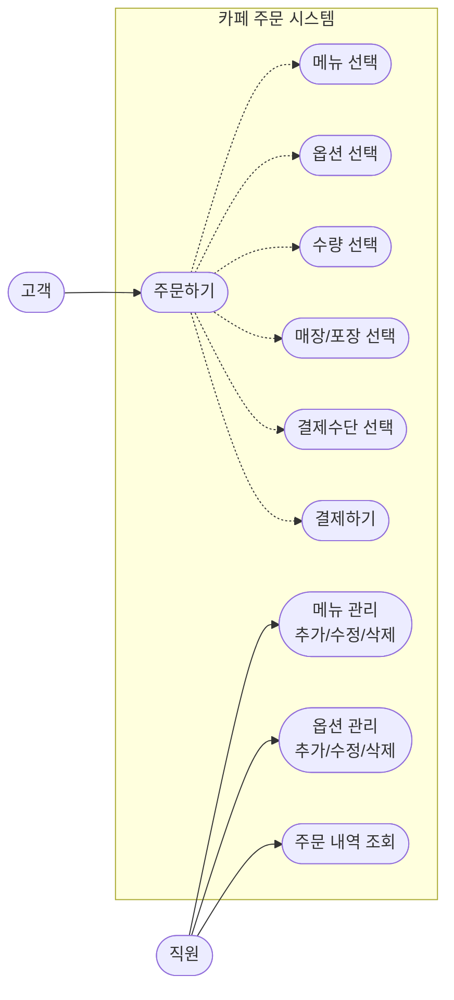
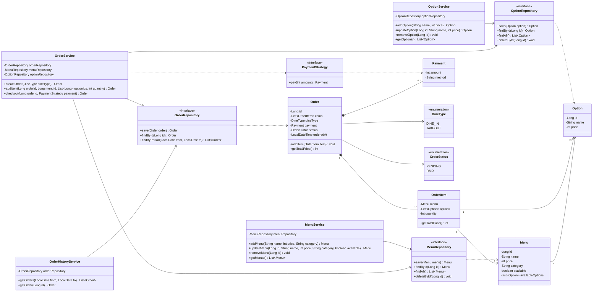
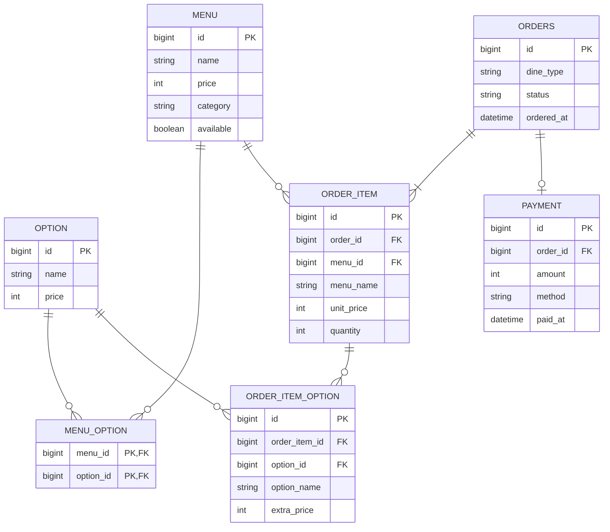

# Cafe Order System
소프트웨어 공학 학습용 프로젝트입니다.

**Features**
 - [요구사항 분석](#요구사항-분석)
 - [유스케이스 다이어그램](#유스케이스-다이어그램)
 - [클래스 다이어그램](#클래스-다이어그램)
 - [ERD](#erd)
 - Strategy 패턴 (결제 수단, `CardPayment` / `CashPayment`)
 - Layered Architecture (Service, Repository, Domain)

## Dev Notes
- [[소프트웨어 공학] AI 에이전트랑 소통하려고 유스케이스 다이어그램 그린 사람]([https://velog.io/@taeyoung-no/%EC%84%9C%EB%B2%84-%EB%B2%A4%EC%B9%98%EB%A7%88%ED%81%AC-%EC%84%B1%EB%8A%A5-%EC%B8%A1%EC%A0%95%EC%9D%84-%ED%81%B4%EB%9D%BC%EC%9D%B4%EC%96%B8%ED%8A%B8%EC%97%90-%EB%A7%A1%EA%B8%B4-%EC%9D%B4%EC%9C%A0](https://velog.io/@taeyoung-no/%EC%86%8C%ED%94%84%ED%8A%B8%EC%9B%A8%EC%96%B4-%EA%B3%B5%ED%95%99-AI-%EC%97%90%EC%9D%B4%EC%A0%84%ED%8A%B8%EB%9E%91-%EC%86%8C%ED%86%B5%ED%95%98%EB%A0%A4%EA%B3%A0-%EC%9C%A0%EC%8A%A4%EC%BC%80%EC%9D%B4%EC%8A%A4-%EB%8B%A4%EC%9D%B4%EC%96%B4%EA%B7%B8%EB%9E%A8-%EA%B7%B8%EB%A6%B0-%EC%82%AC%EB%9E%8C)
- [[소프트웨어 공학] Repository에 interface 도입한 이유]([https://velog.io/@taeyoung-no/%EC%84%9C%EB%B2%84-%EB%B0%B1%EB%A1%9C%EA%B7%B8-%EC%9D%91%EB%8B%B5%EC%9D%B4-%EB%8A%90%EB%A0%B8%EB%8D%98-%EC%9D%B4%EC%9C%A0](https://velog.io/@taeyoung-no/%EC%86%8C%ED%94%84%ED%8A%B8%EC%9B%A8%EC%96%B4-%EA%B3%B5%ED%95%99-Repository%EC%97%90-interface-%EB%8F%84%EC%9E%85%ED%95%9C-%EC%9D%B4%EC%9C%A0)

## 요구사항 분석

### 주문 (고객)

- 메뉴 선택
- 옵션 선택
- 수량 선택
- 매장, 포장 선택
- 결제수단 선택
- 결제하기

### 관리 (직원)

- 메뉴 추가, 수정, 삭제
- 옵션 추가, 수정, 삭제
- 주문 내역 조회

### 유스케이스 다이어그램

## 설계

### 클래스 다이어그램

핵심 구조만 표현하기 위해 interface 구현체는 제외했습니다.

[Multitier architecture](https://en.wikipedia.org/wiki/Multitier_architecture)를 참고해서 Presentation layer, Service layer, 그리고 Data access layer로 나눴습니다. 콘솔 앱이어서 Presentation layer는 표현되지 않습니다. Service 객체와 Domain 객체(`Menu`, `Option`, `Order` 등)는 Service layer, Repository 객체는 Data access layer에 포함됩니다.

### ERD

